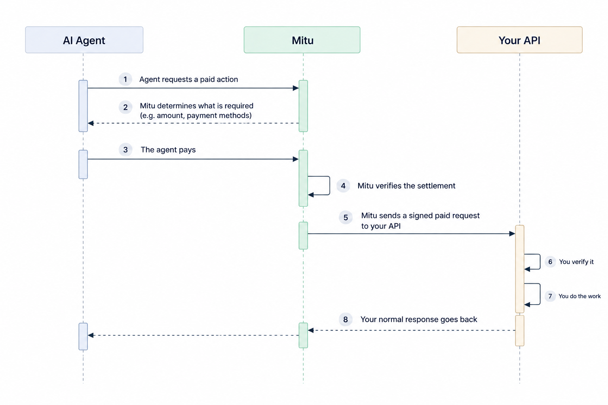

Mitu runs the payment flow so you can go on delivering the product, service, booking or API operation. You do not implement a payment protocol.

<Frame caption="The payment completes before your API is asked to do anything.">
  
</Frame>

You are paid before you are called. That ordering is deliberate, and it has one consequence worth planning for, covered at the end of this page.

## The payment requirement

An agent calling a paid operation gets a `402` describing what it must satisfy.

```json title="402 response body"
{
  "type": "https://paymentauth.org/problems/payment-required",
  "status": 402,
  "intent": "dynamic",
  "service":  { "id": "svc_…", "name": "AgentPizza" },
  "endpoint": { "id": "ep_…",  "path": "/orders" },
  "amount":   { "value": "0.015000", "currency": "USDC" },
  "accepts": [
    { "id": "chal_1", "method": "x402", "network": "base",
      "asset": "USDC", "amount": "0.015000",
      "recipient": "0x1DDb…", "nonce": "0x81e0…" },
    { "id": "chal_2", "method": "mpp_crypto", "network": "tempo",
      "asset": "USDC", "amount": "0.015000", "recipient": "0x1DDb…" },
    { "id": "chal_3", "method": "mpp_spt", "amount": "0.015000",
      "currency": "usdc", "networkId": "profile_…" }
  ]
}
```

<ParamField path="intent" type="fixed | dynamic | tiered | session">
  Which [pricing](/platform/payments/pricing) model produced the amount. On `dynamic` the figure was quoted by you, for this specific request.
</ParamField>

<ParamField path="service" type="object">
  `id` and `name`, so an agent can tell its user who is being paid.
</ParamField>

<ParamField path="endpoint" type="object">
  `id` and `path` of the operation that requires payment.
</ParamField>

<ParamField path="amount" type="object">
  `value` and `currency` for the charge. Each entry in `accepts` repeats it in the terms of its own method.
</ParamField>

<ParamField path="accepts" type="array">
  The challenges the agent may satisfy, each with an `id` and a `method` plus the fields that method needs. The response also sets `WWW-Authenticate`, one entry per challenge, for clients that read the header rather than the body.
</ParamField>

<Warning title="402 does not mean a payment failed">
Nothing has been attempted and nothing declined. It is the protocol saying what is required to continue. An integration that records a 402 as a failure will log one before every successful agent payment it takes.
</Warning>

## How an agent pays

Three methods, two families. You choose which to accept; the payer chooses one it can satisfy. Offering more than one costs nothing and widens who can pay you.

| Method | Settles in | The payer needs |
| --- | --- | --- |
| `x402` | USDC on Base | USDC, and no gas token |
| `mpp_crypto` | USDC on Tempo | USDC on Tempo |
| `mpp_spt` | Card, via a single-purpose token | A card, and no wallet |

**x402** uses EIP-3009 `transferWithAuthorization`. The payer signs an authorisation for the amount and recipient in the challenge; Mitu broadcasts the transaction and pays the gas. That last part matters for agents: a wallet holding only the asset being spent can still settle, with no ETH for gas.

**MPP** covers the other two. `mpp_crypto` is the same idea on Tempo. `mpp_spt` is card-backed, and exists for payers with no wallet at all, which is the common case when the agent is acting for an ordinary consumer.

`mpp_spt` is a method within MPP, not a third protocol standing beside it.

None of this is yours to implement. You accept a method by listing it, and Mitu settles it.

## What reaches your API

Settlement is confirmed before your endpoint sees anything.

| Header | Meaning |
| --- | --- |
| `x-mitu-signature` | Proof the request came from Mitu |
| `x-mitu-request-id` | `req_…`, unique per call. Your idempotency key |
| `x-mitu-amount-charged` | The amount. See the note below |
| `x-mitu-customer-id` | `cus_…`, when the payer is a known Mitu customer |
| `x-mitu-customer-ref` | Your own id for that customer, when applicable |
| `x-mitu-agent-id` | Which agent made the call |
| `authorization` | The customer's own token, when you use OAuth sign-in |

Not every header is on every request. An agent paying from its own funds is nobody's customer, so the customer headers are absent, and that is ordinary rather than a fault.

Only `content-type`, `accept` and `user-agent` are forwarded from the caller; the `x-mitu-*` headers are set afterwards, so a caller cannot supply its own. The incoming `Authorization` is always stripped, because it is the payment credential and is Mitu's business. Where you run OAuth, the customer's token travels separately and is re-emitted to you as `Authorization`.

<Warning title="The amount header does not mean you were paid">
On a **free** endpoint it is present and reads `0`. It is **absent** only on a dynamic-pricing quote. So branching on presence alone treats every free call as a paid one. Compare the value, or branch on the endpoint's pricing model.
</Warning>

## Verify the paid request

```text
x-mitu-signature: t=1757601046,v1=9f3c4a…b2d4

v1 = HMAC-SHA256(signing_secret, "{t}.{request_id}.{amount}.{raw_body}")
```

`amount` is the `x-mitu-amount-charged` header, or an **empty string** when that header is absent, which is what lets one function serve both legs of a dynamic call. `raw_body` is the exact bytes received.

Four rules, and each exists because of a specific failure:

1. **Verify before reading anything else.** The customer id is a plain header and means nothing until the signature proves the request is Mitu's.
2. **Use the raw body.** Parsing and re-serialising changes key order and whitespace, and the check fails. This is the commonest cause of a `401` on a paid request, and it presents as a signing-secret problem when it is not one.
3. **Enforce the timestamp.** Mitu stamps `t`, but only you can reject a stale one. Without a window, a captured request works forever.
4. **Deduplicate on `x-mitu-request-id`.** The signature stays valid for its lifetime, so nothing else stops the same paid request being served twice.

[Request signature verification](/platform/security/request-verification) has a worked implementation and the timing-safe comparison.

## Confirming a payment independently

Signature verification is the primary mechanism and is sufficient. This endpoint is a second, independent check:

```bash
curl --request GET \
  --url https://api.mitu.ai/v1/proxy-requests/req_5f13b916 \
  --header "x-api-key: $MITU_API_KEY"
```

```json title="200 OK"
{
  "request_id": "req_5f13b916",
  "service_id": "svc_dhydwg80dzb4vy6xjl2m",
  "paid": true,
  "amount": "43.200000",
  "currency": "USDC",
  "method": "POST",
  "path": "/orders",
  "payment_method": "x402",
  "wallet_transaction_id": "f5533e85-16d8-4f58-ba22-86dba59c6a15",
  "created_at": "2026-09-11T15:01:32.760Z"
}
```

`paid` is true when an amount was actually taken. Lookups are scoped to your own account.

The shape is deliberate: rather than asserting that payment happened, Mitu exposes something you can call and authenticate yourself. `wallet_transaction_id` names the settlement, which you can check on chain, and that is a stronger position than trusting either a header or this endpoint.

## Paid but not delivered

Settlement happens before your endpoint is called, and it is final. If your endpoint then refuses, you have been paid and the payer has nothing.

```json
{ "delivered": false, "failure_status": 500 }
```

`failure_status` is the status you answered with, and it usually names the cause. A `401` almost always means your signing secret and Mitu's no longer match, or the body was re-serialised before verifying. A `500` is your own code. A `404` means the registered path is no longer served.

Nothing downstream reverses an on-chain settlement, and no retry returns the money. Treat it as money owed: fulfil the work, deliver the result later, or refund the payer. `x-mitu-customer-ref` on the original request maps to your own record, which is usually how you reach them.

Most occurrences come from a short list of causes. A rotated signing secret your backend does not have yet, since rotation is immediate and total with no overlap window. Re-serialising the body before verifying. A deploy that changes or removes the registered path.

The dashboard keeps a running total, and the events below carry the flag.

## Events

`payment.completed` fires when you are paid.

```json
{
  "event": "payment.completed",
  "event_data": {
    "source": "mcp",
    "service_id": "svc_dhydwg80dzb4vy6xjl2m",
    "endpoint_id": "ep_j7z4sqeiyqu7p4ljlg4s",
    "request_path": "/orders",
    "customer_id": "cus_0t9549fps3xd",
    "customer_ref": "auth0|68f3c2a1b9",
    "amount_paid": "0.035000",
    "currency": "USDC",
    "payment_method": "x402",
    "network": "base",
    "transaction_id": "f5533e85-16d8-4f58-ba22-86dba59c6a15",
    "tx_hash": "0xfe093b9a…",
    "reference": "ORDER-8841",
    "delivered": true
  }
}
```

`payment.failed` fires when an attempt did not complete, with a `reason` of `no_supported_method`, `insufficient_balance`, `over_limit`, `settlement_failed` or `upstream_rejected`. They call for different responses: `no_supported_method` usually means the methods on your endpoint are too narrow for the agents reaching you.

### When you are both the wallet issuer and the payee

If one of your own wallet customers pays you, two events describe one movement: `wallet.debited` for their side and `payment.completed` for yours.

Join them on **`tx_hash`**, which is the on-chain settlement and identical on both. Do not join on `transaction_id`: each event names the record in the system that raised it, and they are different rows with different values.

An agent paying from its own funds raises `payment.completed` alone.

## Related

<CardGroup cols={2}>
  <Card title="Pricing" icon="regular tag" href="/platform/payments/pricing">
    How the amount is decided, including dynamic quoting.
  </Card>
  <Card title="Accept payments from agents" icon="regular rocket" href="/guides/integration-guides/accept-payment-from-agents">
    The implementation, end to end.
  </Card>
  <Card title="Request verification" icon="regular shield-check" href="/platform/security/request-verification">
    The algorithm and a worked implementation.
  </Card>
  <Card title="Events" icon="regular bell" href="/platform/webhooks/events">
    Every payload.
  </Card>
</CardGroup>
