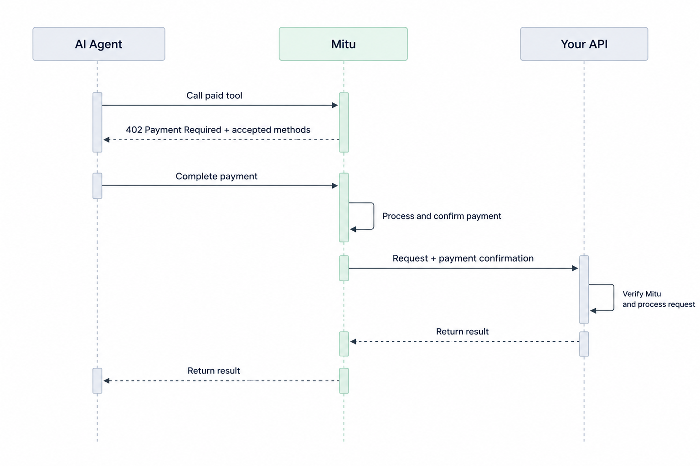

## How agent payments work

When an AI agent calls a paid operation, Mitu handles the payment before your API processes the request.

<Frame caption="Mitu completes the payment before your API is asked to do any work.">
  
</Frame>

Once payment is confirmed, Mitu sends the request to your API with the payment amount, the request id and a verification signature. Verify the request before delivering the product or service: [request verification](/platform/security/request-verification) covers how, and [agent payments](/platform/payments/agent-payments) covers the whole exchange in detail.

You decide which methods to accept. The payer decides which of those it can settle. Neither side negotiates: the requirement lists the options and the agent takes one.

<Note title="A wallet is not a prerequisite">
The payer does not need a Mitu Agent Wallet in order to pay you. An agent can settle from its own funds. [Agent Wallets](/platform/agent-wallets/overview) are a separate product, for businesses that want to issue spending power to their own customers, and a wallet is one possible source of it.
</Note>

## Payment methods

Two families, three methods:

- **x402** settles in USDC on Base.
- **MPP** covers `mpp_crypto`, which settles in USDC on Tempo, and `mpp_spt`, a card-backed payment for payers with no wallet.

[Payment methods](/platform/payments/agent-payments) covers each in detail.

## What gets charged

Price is a property of the endpoint, not of the payer. An endpoint is `free`, `fixed`, `dynamic`, `tiered` or `session`, and that setting decides whether a call produces a payment requirement at all. See [endpoint types](/platform/payments/pricing).

## Paying from a wallet you issued

If the caller is one of your customers and holds a wallet you issued, their agent has a `pay` tool and settles the charge from a wallet they name:

```text
pay({ endpoint: "/orders", method: "POST", body: {...}, wallet: "Travel" })
```

The destination is always your own endpoint. An agent cannot point this at an arbitrary URL.

## Related

<CardGroup cols={2}>
  <Card title="The 402 payment flow" icon="regular arrow-right-arrow-left" href="/platform/payments/agent-payments">
    The payment requirement, field by field.
  </Card>
  <Card title="Payment methods" icon="regular coins" href="/platform/payments/agent-payments">
    x402, `mpp_crypto` and `mpp_spt`.
  </Card>
  <Card title="Dynamic pricing" icon="regular calculator" href="/platform/payments/pricing">
    Quoting a price per call.
  </Card>
  <Card title="Paid but not delivered" icon="regular triangle-exclamation" href="/platform/payments/agent-payments">
    When settlement succeeds and your endpoint does not.
  </Card>
  <Card title="Sell your API to AI agents" icon="regular rocket" href="/guides/use-cases/api-monetisation">
    Charging for an API call, end to end.
  </Card>
  <Card title="Let AI agents buy from you" icon="regular basket-shopping" href="/guides/use-cases/agent-commerce">
    Charging for an order or a booking, end to end.
  </Card>
  <Card title="Payment links" icon="regular link" href="/platform/payments/payment-experiences">
    One charge, payable by a person or an agent.
  </Card>
  <Card title="Payouts" icon="regular building-columns" href="/platform/payments/settlement">
    Getting the money out.
  </Card>
</CardGroup>
